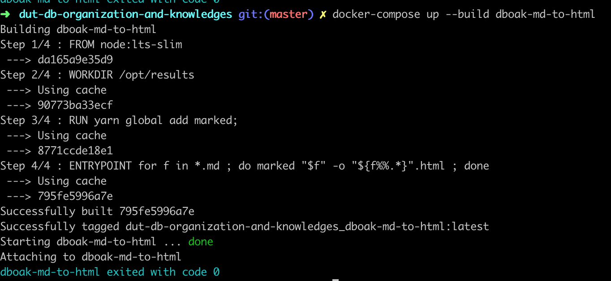
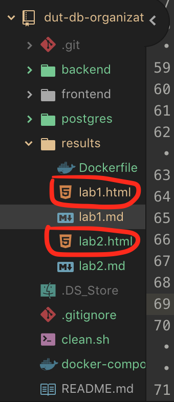

# Лабораторная работа 1
Онлайн версия доступна по [ссылке](https://github.com/specialistvlad/dut-db-organization-and-knowledges/blob/master/results/lab1.md)

## План отчёта
1. Обоснование использования выбранных технологий.
2. Подготовка инструмента формирования отчётов по лабораторным работам
3. Написание отчёта

## Обоснование использования выбранных технологий.
При выполнении лабораторных работ были выбраны несколько ключевых критериев использования технологий:
1. Распространённость
2. Открытость(используется бесплатное ПО и где это возможно с открытым исходным кодом)
3. Кросплатформенность(работа выполняется в ОС macOS, а будет проверяться на ОС Windows)

С преподователем были согласовано такие технологии:
1. Формат отчётов в виде html5 файлов как наиболее универсальное и распростаннённое решение в наше время.
2. База данных - Postgres 11

Об использовании технологий других технологий решения я принимал самостоятельно.

0. [**GIT**](https://wikipedia.org/wiki/Git) - наиболее распределённая система управления версиями
1. [**Markdown**](https://commonmark.org/help/) - наиболее часто используемый формат хранения документации.
По скольку сам стандарт **HTML** для редактирования вручную не очень практичен, было принято решения писать отчёты в формате [**Markdown**](https://commonmark.org/help/)
2. [**marked**](https://marked.js.org/#/README.md#usage) - с помощью этой утилиты с открытым исходным кодом
автоматически преобразовать в **HTML** файлы, которые можно будет открыть локально в любом современном браузере, который поддерживает [**HTML**](https://wikipedia.org/wiki/HTML5) стандарт.
3. [**Docker**](https://www.docker.com/get-started) - как система контейнеризации.
Вам больше не нужно будет устанавливать различное ПО под каждое окружение. У вас больше не будет конфликтов при настройке различного ПО. Вы можете установить хоть сотню БД или любого другого ПО, которое будут работать независимо и одновременно. Достаточно только установить систему контейнеризации.
4. [**Javascript ES7**](https://wikipedia.org/wiki/JavaScript) - мультипарадигменный язык программирования
5. [**Node.js**](https://nodejs.org/en/about/) - Очень популярная технология(фреймворк) для написания серверного ПО
6. [**React.js 16**](https://reactjs.org/) - Очень популярная технология(фреймворк) для создания сайтов в паре с языком **JSX**
7. [**JSX**](https://reactjs.org/docs/introducing-jsx.html) -  это расширение синтаксиса JavaScript, которое позволяет использовать похожий на HTML синтаксис для описания структуры интерфейса.
8. [**Material UI**](https://material.io/) - Самый современный стандарт пользовательского интерфейса созданный в компании Google, который используется в большинстве продуктов всех видов(от ОС Android, web приложениях, десктопное ПО для Windows и даже смарт часах)

## Подготовка инструмента формирования отчётов по лабораторным работам
В интернете была найдена утилита [**marked**](https://marked.js.org/#/README.md#usage) С помощью которой можно локально преобразовать отчёты по лабораторной работе из формата **Markdown** в формат **HTML5**

Для этого подготовим файл docker-compose.yml с описанием контейнера, который будет выполнять преобразования.
А так же описание действий самого контейнера находятся в файле results/Dockerfile

Алгоритм работы:
Контейнер после сборки получит доступ к файлам lab*.md в папке results/, запустит утилиту преобразования marked и сохранит результаты в соответствующие файлы lab*.html

Чтобы запустить контейнер нужно использовать команду
`docker-compose up --build dboak-md-to-html`

В результате появятся файлы

Так же вы можете это сделать вручную онлайн по ссылке [https://marked.js.org/demo/](https://marked.js.org/demo/) или в другом любом удобном конвертере.
