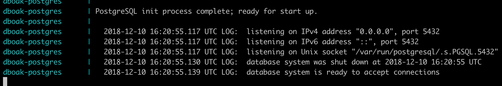
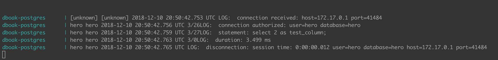
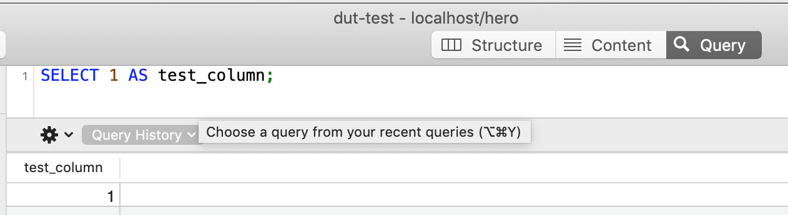
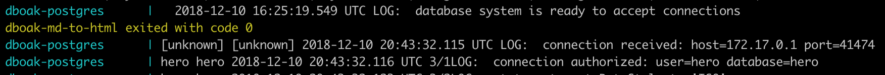

# Лабораторная работа 2
Онлайн версия доступна по [ссылке](https://github.com/specialistvlad/dut-db-organization-and-knowledges/blob/master/results/lab2.md)

## План отчёта
1. Установка БД postgres 11 из официального образа docker.
2. Проверка доступности подключения к БД.

## Установка БД postgres 11 из официального образа docker.
Существуют уже подготовленные образы БД postgres в репозитории образов Docker.
Переходим по ссылке [https://hub.docker.com/_/postgres/](https://hub.docker.com/_/postgres/) и выбираем необходимую версию. Актуальная версия сейчас 11.

Добавляем в наш docker-compose.yml файл описание нового контейнера с БД.

```
dboak-postgres:
  container_name: dboak-postgres
  image: postgres:11
  command: postgres -c config_file=/postgresql.conf
  volumes:
    - ./postgres/postgresql.conf:/postgresql.conf
    - ./postgres/migration/:/docker-entrypoint-initdb.d
  environment:
    - POSTGRES_DB=hero
  restart: always
  network_mode: bridge
  ports:
    - '23395:5432'
  logging:
      options:
          max-size: '50m'
```
Описание параметров далее:
* container_name - произвольное имя
* image - название образа их которого будет создан контейнер(был найден по ссылке выше)
* command - команда запуска БД(взято из документации на образ)
* volumes - ссылки на папки в локальной файловой системе, которые будут доступны из контейнера
* environment - переменные окружения, которые будут доступны в контейнере
* restart - политика запуска контейнера при аварийном завершнии его с не нулевым кодом
* network_mode - режим работы сети
* ports - порты, которые будут проброшены из контейнера в локальную сеть хоста
* logging - параметры логгирования

### Файл конфигурации postgresql
Файл конфигурации postgresql(./postgres/postgresql.conf) быз взят из официальной документации с исправлениями настроек: Отключена запись на диск данных, они будут находиться только в RAM памяти. Это сделано для ускорения работы БД во время разработки. После окончания разработки данные параметры можно вернуть в первоначальное состояние.

### Файлы миграции
Файлы миграции находятся в папке ./postgres/migration/
Создадим один файл с первой миграцией и добавим в него содержимое
```
#!/bin/bash
set -e

psql -v ON_ERROR_STOP=1 --username "$POSTGRES_USER" <<-EOSQL
    CREATE USER hero;
    GRANT ALL PRIVILEGES ON DATABASE hero TO hero;
EOSQL
```

Эта миграция создаст пользователя "hero" и даст ему проставит права доступа внутри БД

### Запустим БД
`docker-compose up`

Ждём пока скачается образ, запустится контейнер, выполнятся миграции.
```
dut-db-organization-and-knowledges git:(master) ✗ docker-compose up
Pulling auth-psql (postgres:11)...
11: Pulling from library/postgres
a5a6f2f73cd8: Pull complete
e50fbea8af5a: Pull complete
73b4855ad326: Pull complete
39616673f22b: Pull complete
94e1b79f69ee: Pull complete
c91e4af2ff8e: Pull complete
16ba314c612f: Pull complete
89011a174cee: Pull complete
d82b02de73e7: Pull complete
ef60eb07c042: Pull complete
225d0988f8bb: Pull complete
eebc8c1ff0d8: Pull complete
b11dada2e405: Pull complete
9723874e6b5f: Pull complete
Creating dboak-psql ... done
Attaching to dboak-psql
dboak-psql   | The files belonging to this database system will be owned by user "postgres".
...
```

Результат работы


На скриншоте видно, что БД ожидает подключение.

## Проверка доступности подключения к БД.
### Используя консольную программу psql
Выполняем команду `echo 'select 2 as test_column;' | psql -h localhost -p 23395 -U hero -d hero;`

В результате SQL запрос `select 2 as test_column;` будет перенаправлен через stdin в программу psql, которая подключится с параметрами ` -h localhost -p 23395 -U hero -d hero` к БД, выполнит запрос, завершится и вернет результат

Лог работы БД

### Используя графическую программу PSequel
Тоже самое но с использованием графической программы с пользовательским интерфейсом.

Окно настройки


Лог подключения к БД


Интерфейс для ввода и выполнения запросов


Лог выполнения запроса в БД

