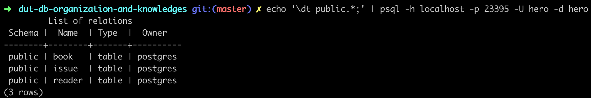

# Лабораторная работа 3
Онлайн версия доступна по [ссылке](https://github.com/specialistvlad/dut-db-organization-and-knowledges/blob/master/results/lab3.md)

## План отчёта
1. Описание схемы БД. Написание файлов миграции.
2. Проверка созданных таблиц.

## Описание схемы БД. Написание файлов миграции.
Опишем в файле postgres/migration/2-schema.sql схему:

* Таблица "Каталог"(порядковый номер записи, библиотечный код книги, автор, название, издательство, год издания, количество страниц, тема, цена) и сервисные поля(дата создания, дата изменения записи, дата удаления записи)
```
CREATE TABLE book(
  id SERIAL PRIMARY KEY,
  code VARCHAR(25) UNIQUE NOT NULL,
  author VARCHAR(100) NOT NULL,
  name VARCHAR(500) UNIQUE NOT NULL,
  publisher VARCHAR(100) NOT NULL,
  published_at date,
  pages INTEGER NOT NULL,
  topic VARCHAR(100) NOT NULL,
  costs MONEY NOT NULL,
  created_at TIMESTAMP NOT NULL DEFAULT now(),
  updated_at TIMESTAMP NOT NULL DEFAULT now(),
  removed_at TIMESTAMP
);
GRANT ALL PRIVILEGES ON TABLE book TO hero;
```
* Таблица "читатели" (номер читательского билета, фамилия, имя, отчество, домашний адрес, домашний телефон, рабочий телефон) и сервисные поля(дата создания, дата изменения записи, дата удаления записи)
```
CREATE TABLE reader(
  id SERIAL PRIMARY KEY,
  last_name VARCHAR(50) NOT NULL,
  first_name VARCHAR(50) NOT NULL,
  middle_name VARCHAR(50) NOT NULL,
  home_address VARCHAR(100) NOT NULL,
  home_phone VARCHAR(13) NOT NULL,
  work_phone VARCHAR(13),
  created_at TIMESTAMP NOT NULL DEFAULT now(),
  updated_at TIMESTAMP NOT NULL DEFAULT now(),
  removed_at TIMESTAMP
);
GRANT ALL PRIVILEGES ON TABLE reader TO hero;
```
* Таблица "выдача книг" (порядковый номер, ссылка на книгу, ссылка на читателя, запланированная дата возврата) и сервисные поля(дата создания, дата изменения записи, дата удаления записи)
```
CREATE TABLE issue(
  id SERIAL PRIMARY KEY,
  book_id INTEGER NOT NULL REFERENCES book(id),
  reader_id INTEGER NOT NULL REFERENCES reader(id),
  created_at TIMESTAMP NOT NULL DEFAULT now(),
  return_at TIMESTAMP,
  updated_at TIMESTAMP,
  removed_at TIMESTAMP
);
GRANT ALL PRIVILEGES ON TABLE issue TO hero;
```

## Перезапуск БД
docker образ БД построен таким образом, что при первом запуске он выполняет последовательно все файлы из каталога скриптов. По этому, чтобы применить миграции необходимо перезапустить контейнер.
`docker-compose up --build`

## Проверка созданных таблиц.
Выполним команду `echo '\dt public.*' | psql -h localhost -p 23395 -U library -d library;`

В результате postgreSQL-специфичный запрос `\dt public.*;` будет перенаправлен через stdin в программу psql, которая подключится с параметрами ` -h localhost -p 23395 -U library -d library` к БД, выполнит запрос, завершится и вернет результат

Таблицы созданы и готовы к использованию.
