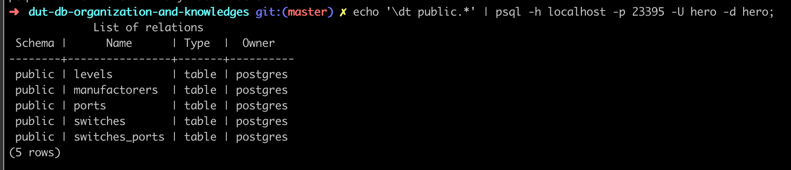
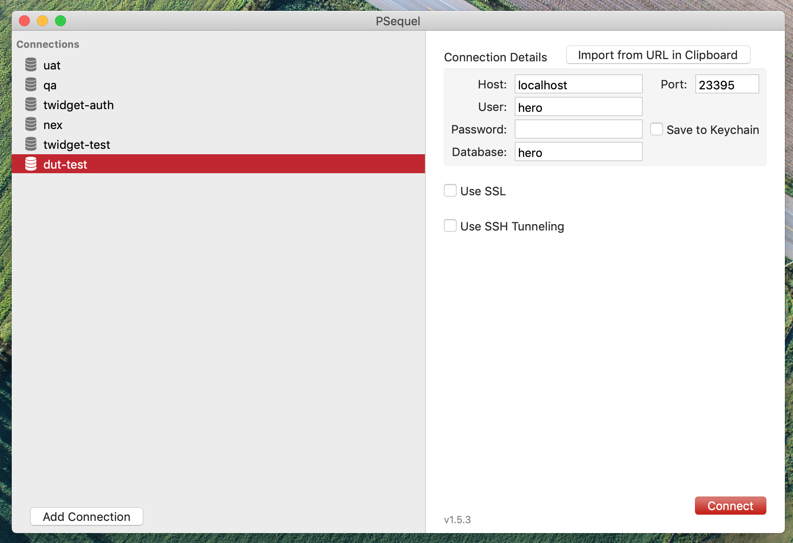
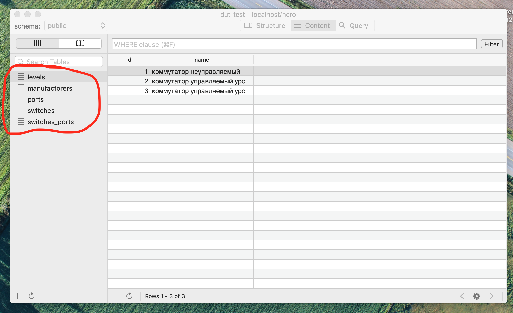
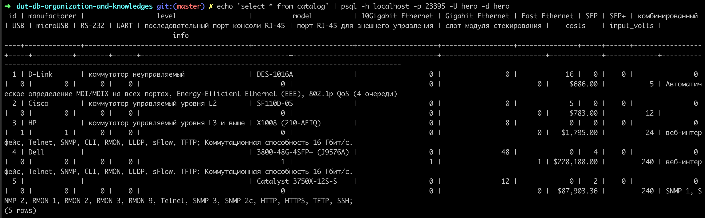
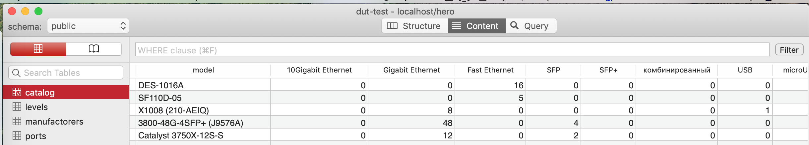

# Практическая работа 4
Онлайн версия доступна по [ссылке](https://github.com/specialistvlad/dut-db-organization-and-knowledges/blob/master/results/lab4.md)

## План отчёта
1. Наполнение БД данными.
2. Применение файлов миграции.
3. Проверка доступности таблиц в БД.
4. Проверка данных в БД.
5. Просмотр каталога.

## 1. Наполнение БД данными.
* Для этого опишем в файле postgres/migration/4-seeding.sql миграцию, которая добавит данные в таблицы:

```
INSERT INTO ports(id, name)
VALUES
  (1, '10Gigabit Ethernet'),
  (2, 'Gigabit Ethernet'),
  (3, 'Fast Ethernet'),
  (4, 'SFP+'),
  (5, 'SFP'),
  (6, 'комбинированный'),
  (7, 'USB'),
  (8, 'microUSB'),
  (9, 'RS-232'),
  (10, 'UART'),
  (11, 'последовательный порт консоли RJ-45'),
  (12, 'порт RJ-45 для внешнего управления'),
  (13, 'слот модуля стекирования');

INSERT INTO levels(id, name)
VALUES
  (1, 'коммутатор неуправляемый'),
  (2, 'коммутатор управляемый уровня L2'),
  (3, 'коммутатор управляемый уровня L3 и выше');

INSERT INTO manufactorers(id, name)
VALUES
  (1, 'D-Link'),
  (2, 'Cisco'),
  (3, 'HP'),
  (4, 'Dell');

INSERT INTO switches(id, name, manufactorer_id, level_id, costs, input_volts, info)
VALUES
  (1, 'DES-1016A', 1, 1, 686, 5, 'Автоматическое определение MDI/MDIX на всех портах, Energy-Efficient Ethernet (EEE), 802.1p QoS (4 очереди)'),
  (2, 'SF110D-05', 2, 1, 783, 12, ''),
  (3, 'X1008 (210-AEIQ)', 4, 2, 1795, 24, 'веб-интерфейс, Telnet, SNMP, CLI, RMON, LLDP, sFlow, TFTP; Коммутационная способность 16 Гбит/с.'),
  (4, '3800-48G-4SFP+ (J9576A)', 3, 3, 228188.00, 240, 'веб-интерфейс, Telnet, SNMP, CLI, RMON, LLDP, sFlow, TFTP; Коммутационная способность 16 Гбит/с.'),
  (5, 'Catalyst 3750X-12S-S', 2, 3, 87903.36, 240, 'SNMP 1, SNMP 2, RMON 1, RMON 2, RMON 3, RMON 9, Telnet, SNMP 3, SNMP 2c, HTTP, HTTPS, TFTP, SSH; ');

INSERT INTO switches_ports(switch_id, port_id)
VALUES
  (1, 3), (1, 3), (1, 3), (1, 3), (1, 3), (1, 3), (1, 3), (1, 3), (1, 3), (1, 3), (1, 3), (1, 3), (1, 3), (1, 3), (1, 3), (1, 3),
  (2, 3), (2, 3), (2, 3), (2, 3), (2, 3),
  (3, 2), (3, 2), (3, 2), (3, 2), (3, 2), (3, 2), (3, 2), (3, 2), (3, 7), (3, 8),
  (4, 11), (4, 12), (4, 13), (4, 4), (4, 4), (4, 4), (4, 4), (4, 2), (4, 2), (4, 2), (4, 2), (4, 2), (4, 2), (4, 2), (4, 2), (4, 2), (4, 2), (4, 2), (4, 2), (4, 2), (4, 2), (4, 2), (4, 2), (4, 2), (4, 2), (4, 2), (4, 2), (4, 2), (4, 2), (4, 2), (4, 2), (4, 2), (4, 2), (4, 2), (4, 2), (4, 2), (4, 2), (4, 2), (4, 2), (4, 2), (4, 2), (4, 2), (4, 2), (4, 2), (4, 2), (4, 2), (4, 2), (4, 2), (4, 2), (4, 2), (4, 2), (4, 2), (4, 2), (4, 2), (4, 2),
  (5, 4), (5, 5), (5, 2), (5, 2), (5, 2), (5, 2), (5, 2), (5, 2), (5, 2), (5, 2), (5, 2), (5, 2), (5, 2), (5, 2);

```

## 2. Применение файлов миграции.
docker образ БД построен таким образом, что при первом запуске он выполняет последовательно все \*.sql и \*.sh файлы из каталога скриптов. По этому, чтобы применить миграции необходимо перезапустить контейнер с принудительной пересборкой.
`docker-compose up --build`

## 3. Проверка созданных таблиц.
### С помощью командной строки
Теперь необходимо убедиться, что таблицы были созданы в БД.
Выполним команду

`echo '\dt public.*' | psql -h localhost -p 23395 -U hero -d hero;`

В результате postgreSQL-специфичный запрос

`\dt public.*;`

будет перенаправлен через stdin в программу psql, которая подключится с параметрами

` -h localhost -p 23395 -U library -d library`

к БД, выполнит запрос, завершится и вернет результат


### С помощью графической утилиты
#### Окно подключения


#### Список таблиц


## 4. Проверка данных в БД
### С помощью командной строки
Выполним команду `echo 'select * from catalog' | psql -h localhost -p 23395 -U hero -d hero`

Видим, что миграция сработала и данные присутствуют в таблице каталоге

### С помощью графической утилиты

