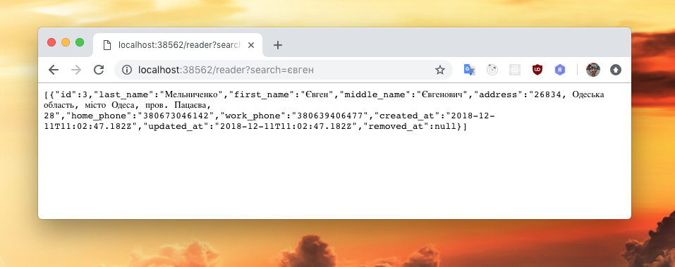
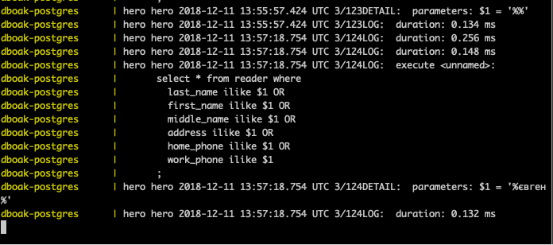

# Практическая работа 6
Онлайн версия доступна по [ссылке](https://github.com/specialistvlad/dut-db-organization-and-knowledges/blob/master/results/lab6.md)

## План отчёта
1. Написание оконечных точек REST сервера.
2. Проверка ответов в браузере.

## Написание оконечных точек REST сервера.

Добавим в файл приложения backend/src/app.js код:
```
app.get('/book', async (req, res) => {
  const searchPattern = req.query.search || '';
  const { rows: result } = await query({
    text: `
    select * from book where
      code ilike $1 OR
      author ilike $1 OR
      name ilike $1 OR
      publisher ilike $1 OR
      topic ilike $1
    ;`,
    values: [`%${searchPattern}%`],
  });
  res.json(result);
});

app.get('/reader', async (req, res) => {
  const searchPattern = req.query.search || '';
  const { rows: result } = await query({
    text: `
    select * from reader where
      last_name ilike $1 OR
      first_name ilike $1 OR
      middle_name ilike $1 OR
      address ilike $1 OR
      home_phone ilike $1 OR
      work_phone ilike $1
    ;`,
    values: [`%${searchPattern}%`],
  });
  res.json(result);
});
```
Разберём как это работает:
* `app.get('/reader', ...function...)` добавляет функцию обработчик, которая будет срабатывать, когда пользователь перейдет по URL /reader
* `const searchPattern = req.query.search || '';` - берет значение, которое было передано в url строке `http://localhost:38562/book?search=блокнот` в параметре search и сохраяет в переменную searchPattern. Если значение нет, то подставляется пустая строка, чтобы приложение корректно работало, когда поискового слова нет. При этом браузер кодирует символы в такой формат `http://localhost:38562/book?search=%D0%B1%D0%BB%D0%BE%D0%BA%D0%BD%D0%BE%D1%82` , а серверный фраемворк 'express' автоматически его декодирует обратно в строку 'блокнот'
* values: `[%${searchPattern}%']` - подставляем строку в шаблон, в результате получится %блокнот%
* ```select * from reader where
  last_name ilike $1 OR
  first_name ilike $1 OR
  middle_name ilike $1 OR
  address ilike $1 OR
  home_phone ilike $1 OR
  work_phone ilike $1
;``` - сам запрос, который выполняет поиск по всем текстовым полям с сформированным шаблоном переданным через параметры
* `const { rows: result } = await query({.....запрос и параметры....});` - посколько сама функция query асинхронная то для корректной работы необходимо ключевое слово `await`, jit среда исполнения дождется результата без блокировки очереди событий по этому может быть выполнено множество запросов одновременно. Ограничение только кол-вом одновременных соединений к БД, что тоже настраивается. По этому фактическое ограничение только в RAM памяти. Далее выполняется `const { rows: result }` деструктуризация объекта с присваиванием значения в константу.
* `res.json(result);` - отправляем результат из БД назад клиенту в браузер

## Перезапустим контейнеры
`docker-compose up --build`


## Проверка ответов в браузере.
Перейдем в браузере по адресу `http://localhost:30562/book` И увидим список всех книг

Перейдем в браузере по адресу `http://localhost:30562/book?search=блокнот` И увидим отфильтрованый список книг

Перейдем в браузере по адресу `http://localhost:30562/reader` И увидим список всех читателей

Перейдем в браузере по адресу `http://localhost:30562/reader?search=євген` И увидим отфильтрованый список читателей

Так же лог БД одного из запросов

