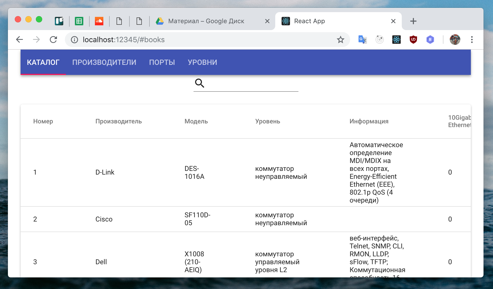
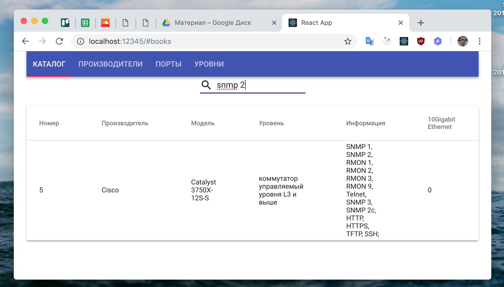

# Практическая работа 9
Онлайн версия доступна по [ссылке](https://github.com/specialistvlad/dut-db-organization-and-knowledges/blob/master/results/lab9.md)

## План отчёта
1. Создание пользовательского интерфейса для просмотра каталога, а также возможности фильтрации

## 1. Создание пользовательского интерфейса для просмотра каталога, а также возможности фильтрации

Для этого нам потребуется изменить два файла
* `frontend/src/Table.js`
* `frontend/src/Tab.js`

В файле `frontend/src/Table.js` нужно динамически отображать колонки исходя из параметра columns и rows.
Смотрите исходный код файлов, пожалуйста, для получения более детальной информации.
```
{columns.map(item => (<TableCell>{item.title || item.name}</TableCell>))}
```

```
{rows.map(row => (
  <TableRow key={row.id}>
    {columns.map((item, index) => (index === 0 ?
      (<TableCell key={item.name} component="th" scope="row" >{row[item.name]}</TableCell>) :
      (<TableCell key={item.name}>{row[item.name]}</TableCell>)
    ))}
  </TableRow>
))}
```

А в файле `frontend/src/Tab.js` нужно добавить поиск и загрузку данных с сервера, а так же передачу параметров columns и rows в компонент Table. Смотрите исходный код файлов, пожалуйста, для получения более детальной информации.

```
buildUrl(entity, search, base = 'http://localhost:30562/') {
  return `${base}${entity}${search ? '?search=' : ''}${search || ''}`;
}

async handleResult(index = 0, search) {
  const rows = await this.download(index, search);
  const columns = this.props.columns[index];

  this.setState({
    ...this.state,
    rows,
    columns,
  })
}

async download(index = 0, search) {
  const urls = ['catalog', 'manufactorers', 'ports', 'levels'];
  const url = this.buildUrl(urls[index], search);
  const result = await fetch(url);
  return result.json();
}

handleChangeTab = async (event, index) => {
  await this.setState({ value: index });
  this.handleResult(index);
};

componentDidMount = async () => {
  this.handleResult();
};

handleChangeInput = async (event) => {
  this.handleResult(this.state.value, event.target.value);
};
```

```
render() {
  const { classes } = this.props;
  const { value, columns, rows } = this.state;

  return (
    <div className={classes.root}>
      <AppBar position="static">
        <Tabs value={value} onChange={this.handleChangeTab}>
          <Tab label="Каталог" href="#books"/>
          <Tab label="Производители" href="#manufactorers"/>
          <Tab label="Порты" href="#ports"/>
          <Tab label="Уровни" href="#levels"/>
        </Tabs>

      </AppBar>
        <Input
        id="input-with-icon-adornment"
        onChange={this.handleChangeInput}
        startAdornment={
          <InputAdornment position="start">
            <Search />
          </InputAdornment>
        }
      />
      <Table columns={columns} rows={rows}/>
    </div>
  );
}
```

### Перезапустим все контейнеры
`docker-compose up --build`

Ожидаем в консоли:
```
dboak-frontend      | Starting up http-server, serving ./build
dboak-frontend      | Available on:
dboak-frontend      |   http://127.0.0.1:8080
dboak-frontend      |   http://172.17.0.7:8080
dboak-frontend      | Hit CTRL-C to stop the server
```

Можно будет проверить результат работы приложения в контейнере по адресу: `http://localhost:32562`

Тестируем все страницы



Тестируем поиск(данные загружаются с сервера в реальном времени)


