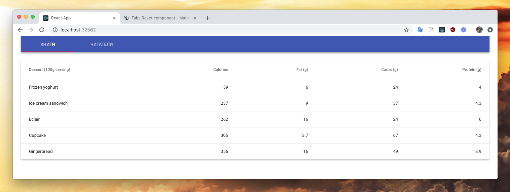
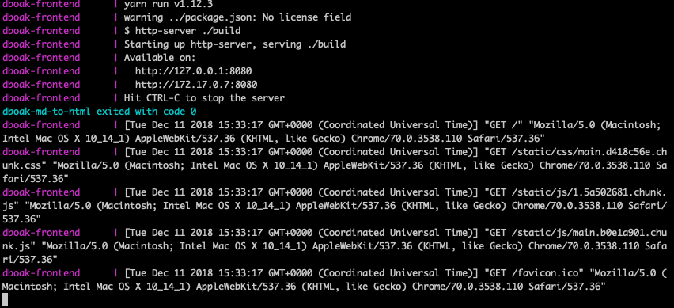

# Практическая работа 9
Онлайн версия доступна по [ссылке](https://github.com/specialistvlad/dut-db-organization-and-knowledges/blob/master/results/lab9.md)

## План отчёта
1. Создание пользовательского интерфейса для просмотра читателей и книг, а также возможности фильтрации

## Создание пользовательского интерфейса для просмотра читателей и книг, а также возможности фильтрации
Добавляем в наш docker-compose.yml файл описание нового контейнера.


```
dboak-frontend:
  container_name: dboak-frontend
  depends_on:
    - dboak-backend
  links:
    - dboak-backend
  build:
    context: ./frontend
    dockerfile: ./Dockerfile
  restart: "no"
  environment:
    - NODE_ENV=production
  network_mode: bridge
  ports:
    - '32562:8080'
  logging:
      options:
          max-size: '50m'
```

### Добавим сервер статических файлов
Для того, чтобы можно получить доступ к приложению в контейнере, нужно установить [сервер](https://www.npmjs.com/package/http-server)

Выполним команду `yarn add static server` из директории `frontend`

Создадим докер файл приложения frontend/Dockerfile
```
FROM node:lts-slim

WORKDIR /opt/app
COPY package.json yarn.lock ./
RUN yarn --frozen-lockfile
COPY public/ ./public
COPY src/ ./src
EXPOSE 8080
RUN yarn build
ENTRYPOINT ["yarn", "serve"]
```


### Файлы миграции
Файлы миграции находятся в папке ./postgres/migration/
Создадим один файл с первой миграцией и добавим в него содержимое
```
#!/bin/bash
set -e

psql -v ON_ERROR_STOP=1 --username "$POSTGRES_USER" <<-EOSQL
    CREATE USER library;
    GRANT ALL PRIVILEGES ON DATABASE library TO library;
EOSQL
```

Эта миграция создаст пользователя "library" и даст ему проставит права доступа внутри БД

### Запустим все контейнеры
`docker-compose up --build`

Ждём пока скачается образ, загрузятся зависимости. Первый раз для каждого контейнера это длительный процесс.
Ожидаем в консоли:
```
dboak-frontend      | Starting up http-server, serving ./build
dboak-frontend      | Available on:
dboak-frontend      |   http://127.0.0.1:8080
dboak-frontend      |   http://172.17.0.7:8080
dboak-frontend      | Hit CTRL-C to stop the server
```
Можно будет проверить результат работы приложения в контейнере по адресу: `http://localhost:32562`


